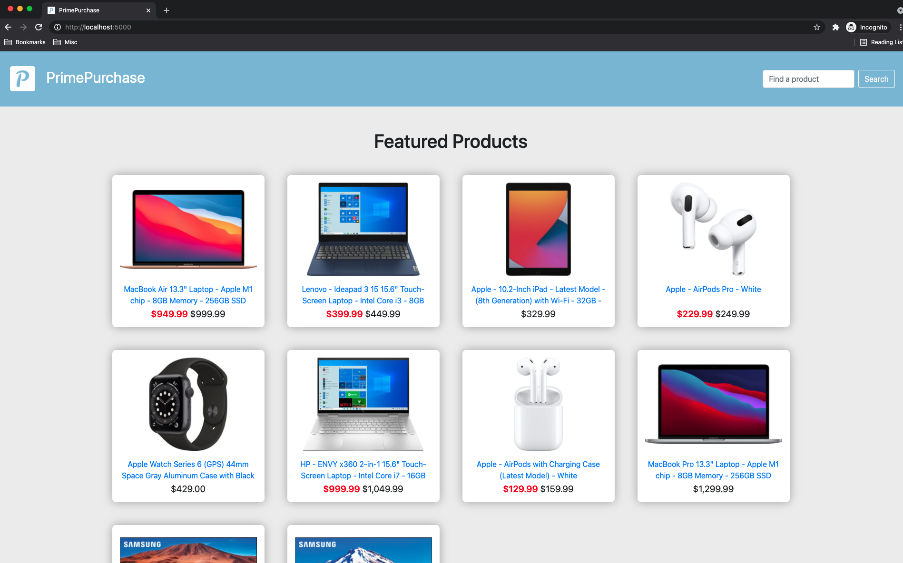
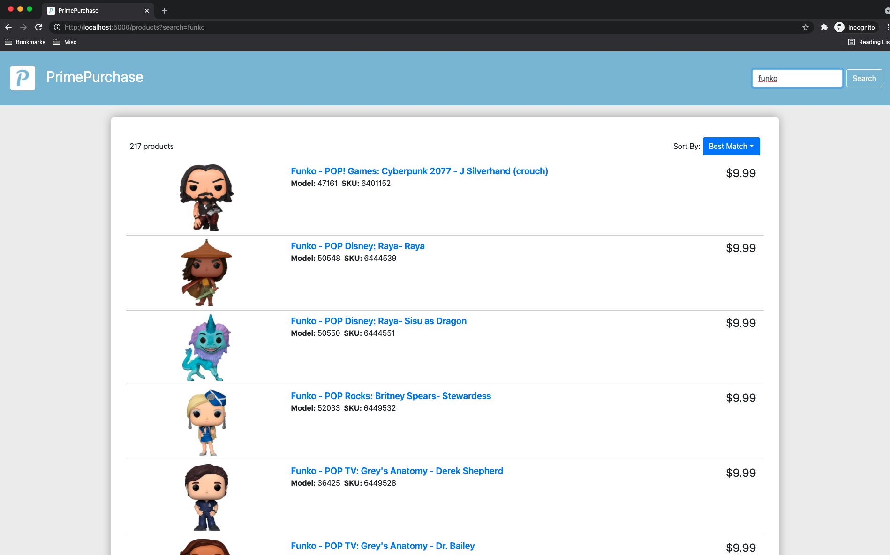
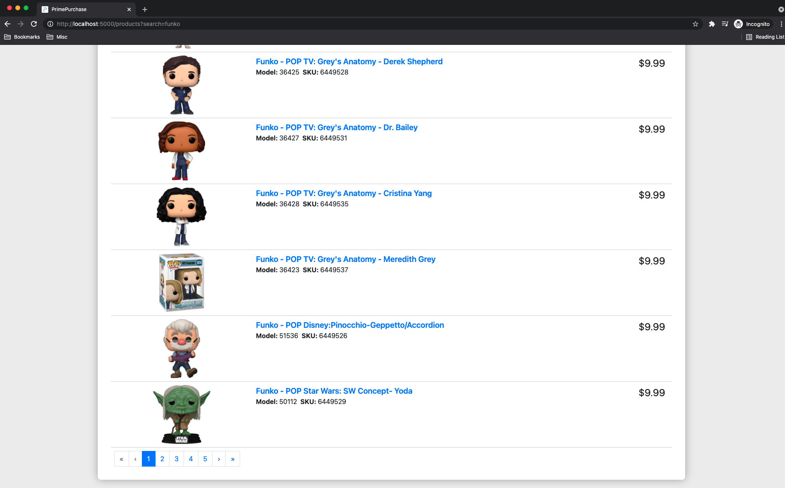
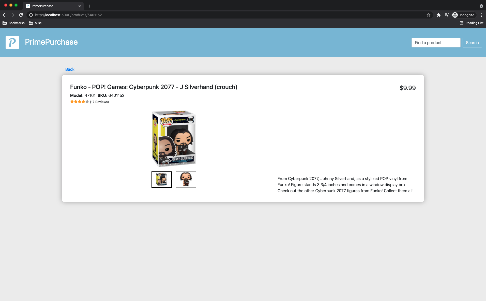

# primepurchase

- Using the Best Buy API, built a UI to display featured products and a list of searched products with the product name, image, and price.
- Built a secondary product detail view, showing more information about the product, like the description.
- Built with code separation, readability, maintainability, testing, and error handling in mind.

Snapshots:

  

    
  

  

    
  

  

    
  

  

    
  

